# Afya Yangu / Mlinzi

**Every person in Kenya carries a guardian in their pocket — a tool that helps them find care today, protect their family tomorrow, and stand together against an outbreak when it comes.**

Public-facing brand: **Afya Yangu** (*My Health*) · Codename: **Mlinzi** (*Guardian*) · Built for Kenya MoH, PHEOC, County Health Management Teams, telcos and implementing partners.

> ⚠️ Figures, hotline codes and platform specifics are drawn from open reporting and are **not independently confirmed** — validate against MoH/PHEOC official channels before external use. The product design is independent of these specifics.

---

## 1 · The problem

Kenya has confirmed an imported Ebola case and activated its response machinery: hotlines, WhatsApp chatbot, border labs, isolation units, HCW training. But there is **no citizen-facing tool that turns every phone into a personal safety device, a community reporting node, and a durable health companion.** The health-system layer is covered; the citizen layer is not. People with fever don't know whether to stay home or seek care; contacts under observation have no structured way to log symptoms; community reporting still requires a phone call; risk awareness stops at the national case count.

**The central strategic insight — an app cannot be built for Ebola alone.** With one case in 50 million people, personal risk is negligible; a fear-driven "Ebola app" gets downloaded, opened twice, and deleted. Therefore the product is layered:

1. **Information delivered through channels people already use** — SMS, USSD, WhatsApp, radio, social, community health workers. No download required. This is the *reach* product.
2. **The app is a genuine year-round health utility** — facility finder, medicine verifier, family health wallet, immunisation tracker, medication reminders. This is the *retention* product.
3. **Outbreak capability is dormant infrastructure** — symptom surveillance, proximity alerting, geofenced risk alerts,LiDAR respiration monitoring — that activates only when PHEOC triggers it. This is the *response* product.

> A user who installs Afya Yangu for the facility finder in November automatically has outbreak surveillance capability in their pocket in March.

## 2 · Vision & design principles

**Design principles:** 1) reach people wherever they are (channel-agnostic); 2) trust is the currency — no false reassurance, no data surprises; 3) low-resource phones are first-class; 4) offline-first, always (every core feature works with no connectivity, sync is opportunistic); 5) privacy by design per DPA 2019/ODPC/Digital Health Act 2023.

**Personas** (prioritised): *Wanjiku* (34, Nairobi salaried) and *Amina* (19, Mombasa job-seeker) drive app + WhatsApp; *Otieno* (28, Kisumu) and *Grace* (52, Siaya, low literacy) drive SMS/USSD/radio; *Mama Zawadi* (45, Busia border) drives the outbreak-relevant border flows; *Dr. Kimani* (41, clinician) drives CHW/facility integration; *Hassan* (22, Garissa) drives CHW-trust flows.

## 3 · Channel architecture (no download required)

| CHAN | Channel | Role |
|---|---|---|
| 0 | Community radio | Health bulletins in vernacular stations; myth-busting |
| 1 | **Zero-rated SMS** | Alerts, triage prompts, geofenced risk alerts — free to receive/send |
| 2 | USSD (`*XXX#`) | Interactive menu: info / facility / symptom report / hotline |
| 3 | **WhatsApp bot (primary information product)** | Triage, Q&A, myth-busting, facility finder |
| 4 | Social media | Content dissemination + misinformation response |
| 5 | Human intermediaries | CHWs, village elders, faith leaders — the trust layer |
| 6 | Native application | Full utility + dormant outbreak power |

## 4 · Feature model (four tiers)

- **Tier 1 — Earns the Download (weeks 0–8):** febrile-illness triage (with the **malaria trap**: fever without contact history is treated malaria-first — never EVD-alarm first; escalation requires exposure or a full symptom cluster), facility finder (all 47 counties), ED status, testing sites, pharmacies, vaccination points, medicine verifier (PPB registry), drug interactions, dosage calculator, **Emergency SOS with auto-alert**, fall detection, offline emergency card, county risk dashboard, "What should I do?" decision tree, EVD info + myth-busting, travel advisory, hotline directory (719).
- **Tier 2 — Earns the Return Visit (months 2–6):** appointment booking/queue management, drug-stock crowdsourcing, family health wallet (basic), service status feed, health tips, first aid, enhanced diaries.
- **Tier 3 — Earns the Home Screen (months 4–12):** full family health wallet, growth monitoring, safe-and-dignified-burial guidance, daily-habit surfaces.
- **Tier 4 — The Outbreak Superpower (dormant until activated):** EVD-specific triage, symptom surveillance, geofenced risk alerts, proximity alerting (BLE tokens), LiDAR respiration monitoring (12–25 br/min), acoustic cough detection, camera symptom capture, **Emergency SOS in outbreak mode**.

The **three-key activation gate** is enforced at every layer: PHEOC authorization + reviewed DPIA + feature flag — all three, or Tier 4 stays dark.

## 5 · Capability highlights

- **Privacy by design (DPA 2019 / ODPC / Digital Health Act 2023):** consent ledger with withdrawal + bounded retention (24-month cap for citizen data; legal-obligation basis for mandatory notification), automated **DPIA gate that blocks any raw-sensor retention**, RBAC with 8 scoped roles, 72-hour breach clock with ODPC + high-risk recipient logic, structural anonymization (phone/id masking, county-level location generalization).
- **Raw sensor data never leaves the handset.** Only derived metrics travel: respiration *rates* (not audio/depth), cough *counts* (not audio), fall *verdicts* (not accelerometer traces) — enforced in the type system, not by policy.
- **Evidence with integrity:** photo + textual note submissions are sha256-verified, mime-whitelisted, size-capped, deduplicated, and tier-4-gated for EVD symptoms — routed for clinician review.
- **On-device ML:** YAMNet (AudioSet, 521 classes) via ONNX for acoustic cough detection (16 MB), identical band semantics implemented three times (server/Swift/Kotlin). No dermatology classifier is shipped **deliberately** — a wrong "not-EVD" photo verdict is a public-health hazard; evidence + clinician review is the clinical path.
- **Everyday health domains (beyond EVD):** SHA/NHIF cover check + price transparency (what does a C-section cost?), 24-hour pharmacies, crowdsourced wait times + drug stock, multi-disease differential triage (malaria/typhoid/flu/cholera/COVID + EVD), maternal ANC (8-contact WHO schedule + danger-sign escalation), menstrual cycle tracking, chronic disease companion (BP/glucose trends + refill alerts), WHO-5 mental health with counselling lines, blood donor matching (compatibility matrix + 90-day eligibility), lab results & prescriptions wallet, water-quality/air-quality advisories, flood→cholera risk linking, school-closure/notice alerts, and multi-disease outbreak surveillance (cholera, malaria, dengue, mpox, RVF — not just EVD).
- **Delivery constraints honored:** debug APK <15 MB (currently ≈0.9 MB), minSdk 24 (Android Go-era devices), zero-rated channel contracts, works offline by default.
- **Offline-first + conflict rules:** every write lands locally first; the sync queue uses the spec's conflict matrix (last-write-wins for personal data, server-authoritative for case reports/immunisations/content, append-only for proximity tokens) with bounded exponential backoff; nothing is lost across restarts.
- **Clinical safety rails:** PPB-backed medicine verification (fail-closed: unreachable registry ⇒ "verify manually"), interaction table with severity bands, weight-based dosing with paediatric warnings, 21-day observation window caps, EPI schedule gap detection for children (guardian-consent enforced for minors).

## 5a · Fully implemented feature table (97 registered + 2 insurance)

| ID | Feature | Tier | Implementation |
|---|---|---|---|
| | **Channels** | | |
| CHAN-000 | Community Radio | T1 | GET radio broadcast contracts (content library) |
| CHAN-001 | SMS Zero-Rated | T1 | POST /channels/sms (GSM-7 segmentation, zero-rated) |
| CHAN-002 | USSD | T1 | POST /channels/ussd + /channels/ussd/callback (AT CON/END, en/sw) |
| CHAN-003 | WhatsApp Bot | T1 | POST /channels/whatsapp (router) · WA Cloud API client |
| CHAN-004 | Social Media | T1 | social dissemination contracts |
| CHAN-005 | Human Intermediaries | T2 | POST+GET /channels/chw/tasks (+done) |
| CHAN-006 | Native Application | T1 | native push payload contracts |
| | **Information** | | |
| INF-001 | County Risk Dashboard | T1 | GET /info/dashboard/{county} |
| INF-002 | What Should I Do Decision Tree | T1 | decision tree (library-embedded, tested) |
| INF-003 | Ebola Information Library | T1 | harmonised en/sw content library |
| INF-004 | Myth-Busting Library | T1 | myth-busting seed |
| INF-005 | Travel Advisory | T1 | travel advisory content |
| INF-006 | Hotline and Contact Directory | T1 | GET /info/hotlines |
| INF-007 | Service Status Feed | T2 | service status feed (registry) |
| INF-008 | Health Tips and Education | T3 | tips content |
| INF-009 | First Aid Guide | T3 | first aid content |
| INF-010 | Safe and Dignified Burial Guidance | T3 | burial guidance content |
| INF-011 | Water Quality Alerts | T2 | POST /environment/water |
| INF-012 | Air Quality | T2 | POST /environment/air |
| INF-013 | Flood and Weather Alerts | T2 | POST /environment/flood (+auto cholera alert) |
| INF-014 | School Closures and Public Notices | T1 | POST /alerts (school_closure) + GET /alerts/{county} |
| INF-015 | Traditional and Herbal Safety | T1 | herbal safety content |
| INF-016 | Price Transparency | T2 | GET /insurance/quote/... |
| | **Triage** | | |
| TRI-001 | Broad Febrile-Illness Triage | T1 | POST /triage/preliminary + /triage/diagnose (6-disease differential, malaria trap) |
| TRI-002 | Symptom Diary and Follow-Up | T1 | POST+GET diary (21-day window) |
| TRI-003 | Ebola-Specific Triage | T4* | POST /triage/evd (tier-4 gated) |
| | **Facilities** | | |
| FND-001 | Facility Finder | T1 | POST /facilities/nearest (haversine, kind filter, 24h) |
| FND-002 | Emergency Department Status | T1 | GET /facilities/{id}/ed-status |
| FND-003 | Testing Site Locator | T1 | testing sites (kind filter) |
| FND-004 | Pharmacy and Chemist Finder | T1 | pharmacies + crowdsourced wait medians |
| FND-005 | Vaccination Point Finder | T1 | vaccination points (kind filter) |
| FND-006 | Appointment Booking and Queue Management | T2 | POST /facilities/{id}/booking (queue monotonic) |
| | **Medicine** | | |
| MED-001 | Medicine Verifier | T1 | POST /medicine/verify (PPB port + offline fail-closed stub) |
| MED-002 | Drug Interaction and Safety Checker | T1 | POST /medicine/interactions |
| MED-003 | Dosage Calculator | T1 | POST /medicine/dose |
| MED-004 | Drug Stock Crowdsourcing | T2 | stock crowdsourcing service (report/stock_for) |
| | **Emergency** | | |
| EMG-001 | Emergency SOS | T1 | POST /emergency/sos (719 fan-out, geofence, SMS actions) |
| EMG-002 | Fall Detection and Auto-Alert | T1 | POST /emergency/fall (freefall-before-impact signature) |
| EMG-003 | Offline Emergency Card | T1 | offline card + QR (both apps) |
| | **Records & wellbeing** | | |
| REC-001 | Family Health Wallet Basic | T2 | GET /records/{ref}/wallet (family members + EPI gaps) |
| REC-002 | Family Health Wallet Full | T3 | wallet artifacts: labs/prescriptions (service) |
| REC-003 | Growth Monitoring Chart | T3 | POST /records/growth (underweight/stunted flags) |
| REC-004 | Blood Donor Matching | T2 | POST /blood/match (compatibility+90d+county) |
| REC-005 | Mental Health Support | T2 | POST /mental/who5 + GET /mental/lines |
| REC-006 | Chronic Disease Companion | T2 | POST /chronic/bp·glucose·refill + bp-trend |
| REC-007 | Lab Results and Prescriptions Wallet | T3 | LabResult + Prescription (service) |
| REC-008 | Maternal ANC Tracker | T2 | POST /maternal/* (pregnancy, anc-due, danger) |
| REC-009 | Menstrual Cycle Tracking | T2 | POST /women/cycle + predict |
| | **Location** | | |
| LOC-001 | Geofenced Risk Alerts | T4* | geofence registry + proximity + outbreak geofences |
| | **Sensors & ML** | | |
| SENS-001 | LiDAR Respiration Monitoring | T4* | POST /sensors/breath/estimate (motion series -> brpm) + band |
| SENS-002 | Acoustic Cough Monitoring | T4* | POST /ml/cough/analyze (YAMNet ONNX, tier-4 gate) |
| SENS-003 | Fall Detection | T1 | fall ingest kind |
| SENS-004 | Camera Symptom Capture | T4* | POST /evidence (photo+note, sha256, dedupe) |
| SENS-005 | PPG Health Monitoring | T2 | ppg ingest band |
| SENS-006 | Wearable Integration | T2 | wearable sync ingest (derived only) |
| SENS-007 | Sleep and Activity Monitoring | T2 | sleep band ingest |
| SENS-008 | Environmental Ambient Sensing | T4* | ambient PM2.5 band |
| SENS-009 | Steps and Activity | T2 | activity ingest (registered) |
| SENS-010 | Sensor Fusion | T2 | multi-sensor derived-metric fusion (registered) |
| | **Monitoring & reminders** | | |
| MON-001 | Child Immunisation Tracker | T2 | /monitoring/child/* — EPI schedule, catch-up, per-dose status |
| MON-002 | Pregnancy and Antenatal Care Tracker | T2 | /maternal/* ANC schedule + danger signs |
| MON-003 | Chronic Disease Log | T2 | /monitoring/chronic/* — peak flow zones, weight, clinician report |
| MON-004 | Medication Reminders | T2 | /monitoring/medication/* — adherence + refill detection |
| MON-005 | Water Quality Alerts | T3 | /environment/water |
| MON-006 | Air Quality Index | T3 | /environment/air |
| MON-007 | Vector Control | T3 | /monitoring/vector-risk + breeding-site reports |
| MON-008 | Nutrition and Food Safety | T3 | /monitoring/nutrition + food alerts |
| MON-009 | Contact Monitoring (21-day) | T4* | /monitoring/contact/* — diary, fever escalation |
| | **Community & rumours** | | |
| COM-005 | Community Issue Reporting | T1 | /community/issues — routed to the county authority |
| COM-101 | CHW Case Reporting | T2 | /community/cases + /chw/* — automatic officer alert |
| COM-102 | Peer-to-Peer Alerting | T4* | /community/peer-alert — verified senders only |
| COM-103 | Contact Tracing Support | T4* | /community/contacts + tracing prompts |
| COM-104 | Misinformation Tracking | T1 | /community/misinformation + cluster detection |
| | **Alerting** | | |
| ALT-001 | Unified Alert Feed | T1 | /alerting/feed — verified items only |
| ALT-002 | Family Safety Board | T2 | /alerting/family/* |
| ALT-003 | Alert Preferences | T1 | /alerting/preferences — critical categories have no off switch |
| ALT-004 | Exposure Notification | T4* | /alerting/exposure — acknowledgement + callback offer |
| | **Location** | | |
| LOC-002 | Privacy-Preserving Proximity | T4* | /location/proximity/* — rotating EBID, proxied declarations |
| LOC-003 | Location History | T4* | /location/history/* — geohash-only, 5-char cell on share, purge |
| LOC-004 | Check-In Points | T4* | /location/checkin/* — QR/NFC/manual, per-kind guidance |
| LOC-005 | Border and Travel | T4* | /location/border + /location/traveller/* — 1/3/7/14/21-day schedule |
| | **AI and analytics** | | |
| AI-001 | Outbreak Hotspot Prediction | T4* | /ai/hotspots — small-cell suppression, per-hotspot reason |
| AI-002 | Personal Risk Score | T4* | /ai/risk-score — computed on device, never uploaded |
| AI-003 | Early Warning Signal | T4* | /ai/early-warning — routes to a human, never auto-publishes |
| AI-004 | Model Governance | T2 | /ai/models + fairness audit over 4 axes |
| AI-005 | Algorithmic Redress | T2 | /ai/redress — always human reviewed |
| | **Access and fairness** | | |
| ACC-001 | Accessible UI | T1 | /access/screens — 48dp targets, pictograms, read-aloud |
| ACC-002 | Multilingual and Voice | T1 | /access/languages + /access/voice — 13 languages, offline |
| ACC-003 | Low-Literacy Support | T1 | simple mode + spoken replies |
| ACC-004 | Battery and Data Economy | T1 | /access/battery — <=5%/day per intensity |
| ACC-005 | Device Compatibility | T1 | /access/compatibility — Android Go, no Play Services |
| | **Privacy and security** | | |
| SEC-001 | Consent Management | T1 | /privacy/consent + /privacy/dpia |
| SEC-002 | Data Minimisation | T1 | raw sensor data never leaves the handset (enforced by model shape) |
| SEC-003 | Encryption | T1 | /retention/encryption — AES-256 at rest, TLS 1.3 |
| SEC-004 | Audit Logging | T1 | per-service structured logs |
| SEC-005 | Retention and Deletion | T1 | /retention/* — finite windows, DELETE MY DATA on any channel |
| SEC-006 | Transparency | T1 | /retention/inventory + /retention/transparency |
| INS-001 | SHA cover check | T2 | POST /insurance/sha-check |
| INS-002 | price transparency | T2 | POST /insurance/prices + GET quote |

*T4 = dormant behind the three-key gate (PHEOC + DPIA + flag). 97 features registered across all 15 spec namespaces; every id in the spec resolves (tests/ci/test_spec_coverage.py). Spec ids never reach a screen — served payloads carry semantic slugs only (tests/ci/test_ui_vocabulary.py).*

## 6 · Product management & phasing

| Phase | Window | Channels | Tiers | Success criteria |
|---|---|---|---|---|
| 1 — Information First | Weeks 0–4 | CHAN-0..5 | info | 500k SMS opt-ins · 100k WA users · 50 stations |
| 2 — Utility Launch | Weeks 2–8 | +CHAN-6 | T1 | 300k installs · 40% D30 · 50k triages |
| 3 — Retention Build | Months 2–6 | all | T1–2 | 1M installs · 25% DAU/MAU · 100k children tracked |
| 4 — Daily Habit | Months 4–12 | all | T1–3 | habit surfaces live |
| 5 — Outbreak Ready | Months 6–12 | all | T1–4 | tier-4 proven in drills |
| 6 — Scale & Sustain | Month 12+ | all | all | multi-disease, national integration |

**North-star metrics (12 months):** 15M people reached · 3M protected (triaged with actionable guidance) · 35% DAU/MAU · lives-saved measured via modelling. Reach KPIs: 2M downloads, 3M SMS opt-ins, 2M WA users, 500k USSD sessions/month, 10M weekly radio reach, 5,000 CHWs.

## 7 · Product-market fit

- **Why Kenya, why now:** 50M+ phone lines, near-universal SMS/voice reach, WhatsApp as de-facto messaging layer, active MoH digital-health program (ADaM, JALI, DHIS2, KMHFL) to integrate with, and a live EVD response creating legitimate demand for surveillance infrastructure. Distribution economics: zero-rating (data-free SMS/app traffic agreed with telcos) removes the access tax that kills rural usage.
- **Why this survives contact with users:** the app earns its home-screen slot via daily-year-round utility (wallet/reminders/facilities), not fear; the fear-shaped features sit dormant until needed. The bot-and-radio layer protects the 80% who will never install anything.
- **Who pays / who builds:** MoH/Digital Health Agency owns product; implementing partners + telcos distribute; ODPC-registered data flows; PHEOC consumes signals. Revenue is *not* the point — public-health ROI (earlier detection, fewer contacts lost) is, with per-tier evaluation hooks built in.
- **Falsifiable bets:** (a) year-round utility achieves ≥35% DAU/MAU; (b) dormant-capability prepositioning beats a reactive outbreak app on deployment speed; (c) consent-first, low-identifiability proximity data survives public scrutiny. Each has metric plumbing in this repo.

## 8 · Theoretical underpinnings

- **AVADAR (polio, ten African countries):** CHW-mediated mobile reporting works when the tool is simple and alerting is automatic → CHAN-5 task model + auto-alert fan-out.
- **Offline-first modular mHealth (ACM MobiSys-class):** the client is the source of truth; sync is a bonus → §16 queue design implemented in sync/ and both app caches.
- **DESIRE architecture (COVID-19 exposure notification):** privacy-preserving proximity is feasible only if opt-in and transparent, combining centralised + decentralised elements around ephemeral identifiers and private encounter tokens (PETs routed via trusted proxy) → SENS proximity-token store (append-only) + consent gating.
- **LiBre LiDAR respiration (§2.3):** motion-resilient decoupling of device motion from chest displacement at ≤4 m, sub-1-brpm error, <120 ms/frame → estimation split (on-device motion series → server peak-window estimation + 12–25 br/min banding).
- **Information theory lens:** the malaria trap is a **prior-probability correction** — with EVD prevalence ~2×10⁻⁸, presenting symptom-alarm first maximizes false-alarm cost at the expense of the base-rate disease (malaria) that will actually be present; the triage ladder re-orders the hypothesis tree by base rate, with exposure evidence shifting the posterior.
- **Game theory lens (trust):** citizen-reporting channels die on fear of data misuse; the DPIA gate + structural minimisation + breach clock are commitment devices that make cooperation (reporting symptoms) incentive-compatible for the sender.

---

## 9 · What is implemented here

A working vertical of the spec: FastAPI backend core (162 operations over 160 paths, 97-feature registry, all 10 sensor families, tier-4 gate, Postgres+SQLite persistence, vendor gateway clients), **fully native** SwiftUI iOS + Kotlin Android clients (offline-first, evidence upload, feature screens, catalogue-driven action forms), and YAMNet ONNX cough analysis — with **backend tests green, pyright-clean types, iOS XCTest and Android JVM suites green**. §15.5 is complete: REST, WebSocket alert delivery, gRPC for internal calls, `/v1` versioning, OAuth 2.0 + PKCE and anonymous tokens, idempotency keys, per-device rate limiting, and a published OpenAPI 3.1 spec.

Full engineering map (spec § → module → test): [`docs/buildout.md`](docs/buildout.md) · ML provenance/decisions: [`docs/ml-models.md`](docs/ml-models.md) · full product spec: [`docs/spec.md`](docs/spec.md).

## 10 · Quickstart

```sh
uv sync && uv run pytest -vxs tests/ci && uv run pyright      # backend + tests (109 green)
uv run uvicorn afya.service:app --port 8000                    # API (OpenAPI at /docs)
createdb afya && uv run python examples/deploy_schema.py       # local Postgres schema
uv run python examples/demo.py                                 # end-to-end narrative demo

cd ios && xcodegen generate && xcodebuild -project AfyaYangu.xcodeproj -scheme AfyaYangu \
	-destination 'generic/platform=iOS Simulator' build CODE_SIGNING_ALLOWED=NO
cd android && gradle testDebugUnitTest assembleDebug           # APK under app/build/outputs/apk/debug/
```

Backend code: `src/afya/` (per-domain `service.py` logic + `views.py` Pydantic v2 models) · native clients: `ios/` (xcodegen project.yml) and `android/` (Gradle Kotlin DSL) · models: `models/cough/`.

## 12 · Screens (captured from the emulators/simulators)

Android (Pixel 3a API 34, emulator, live backend on `:8123` via `adb reverse`) and iOS (iPhone 15 Pro simulator, live backend).

| | |
|---|---|
| **Android home** — connection state + EVD-contact triage chips | 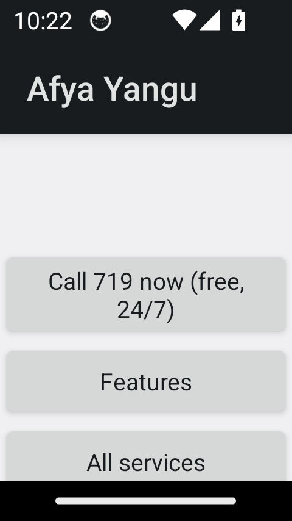 |
| **Android triage result** — malaria-trap verdict (spec 6.3) |  |
| **Android feature surfaces** — finder/wallet/diary/CHW/sensors | 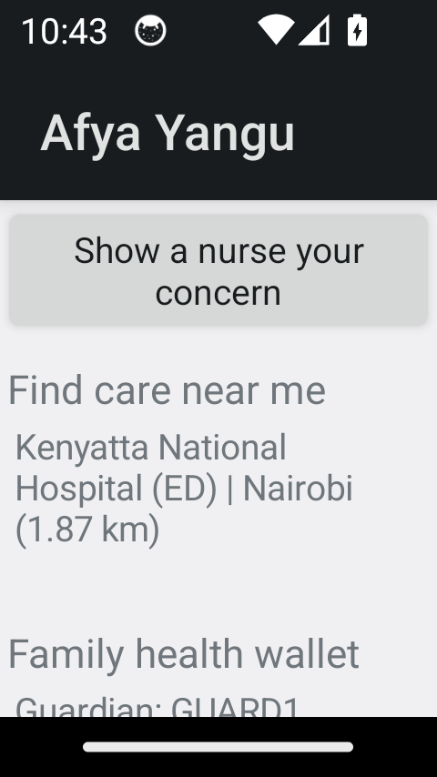 |
| **Android all services** — the served catalogue, grouped by human label | 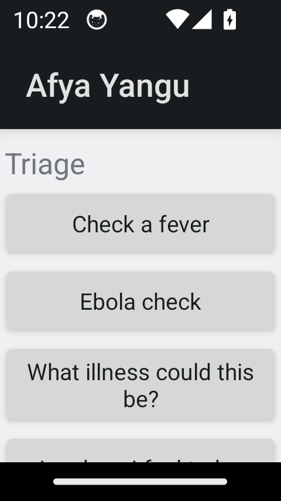 |
| **Android action form** — built from the action's own field list | 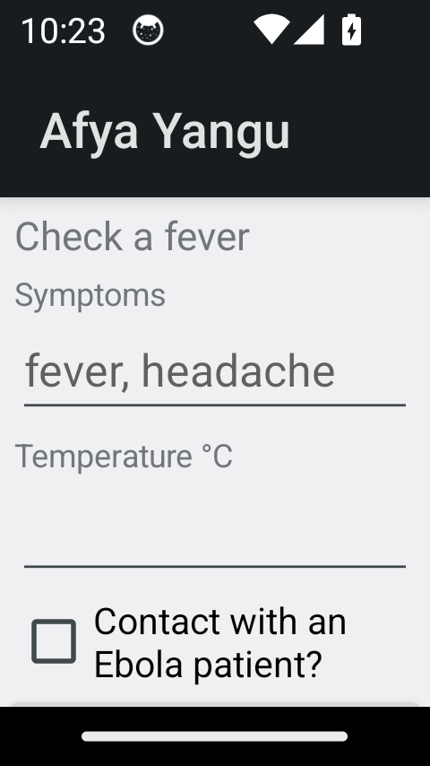 |
| **Android evidence upload** — photo + note (SENS-004) | 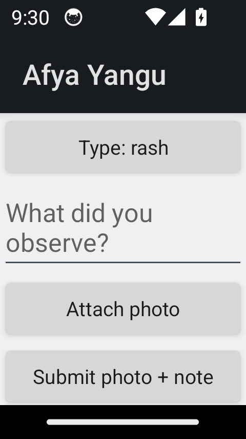 |
| **Android maps** — OpenStreetMap places + navigation handoff | 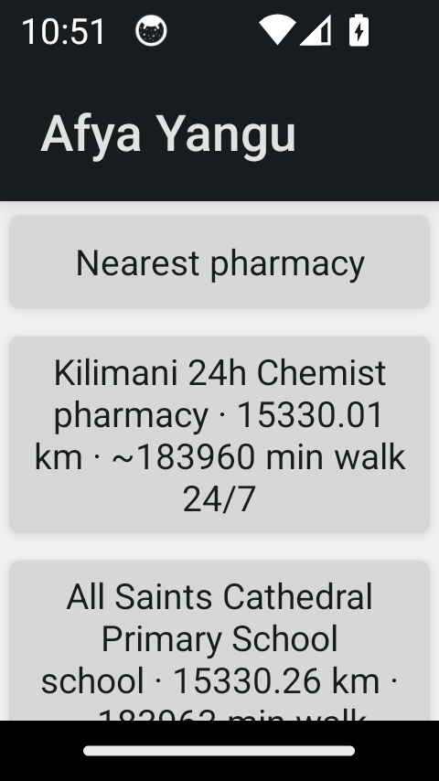 · 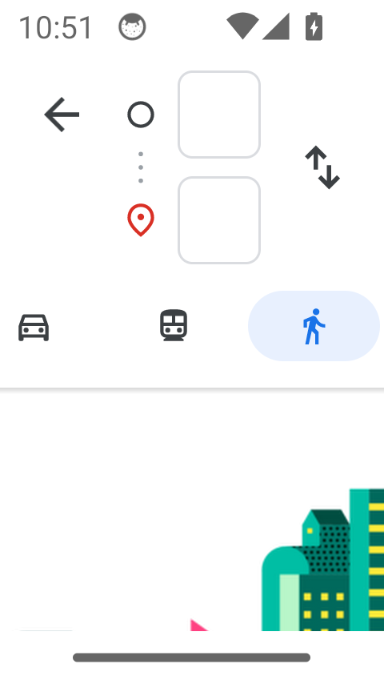 |
| **iOS status** · **iOS finder** | 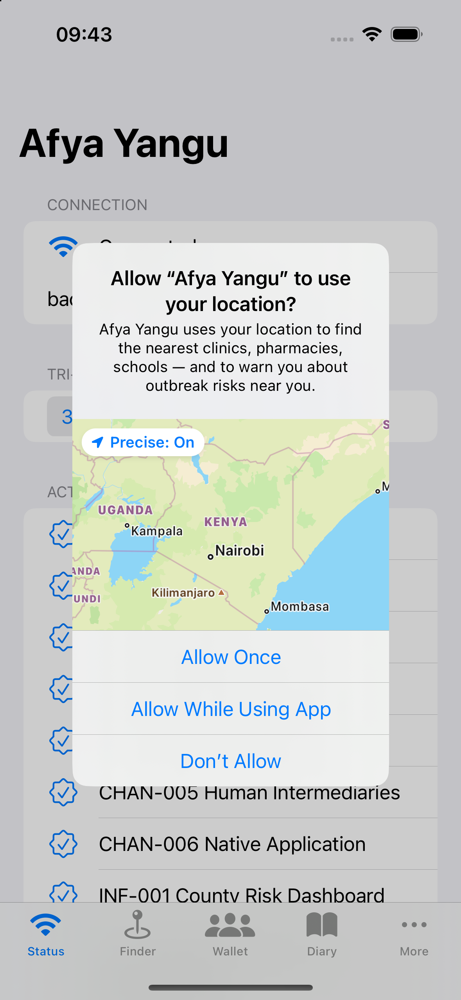 · 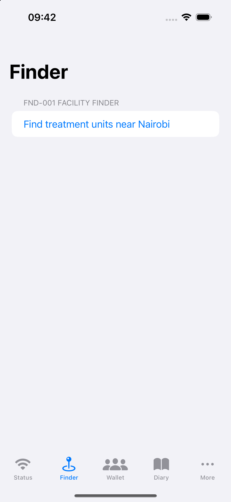· |
| **iOS wallet** · **iOS diary** | 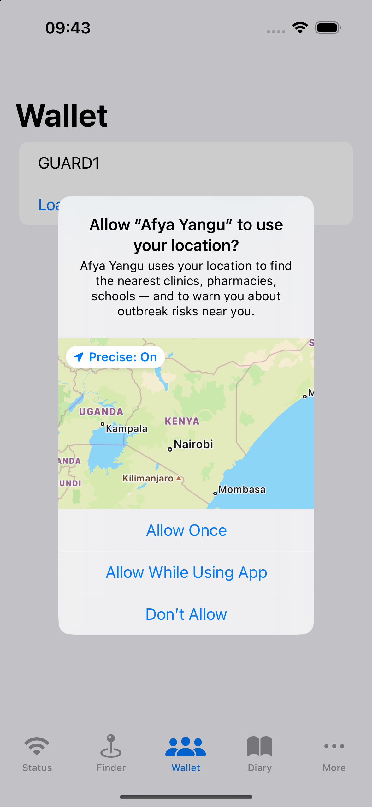 · 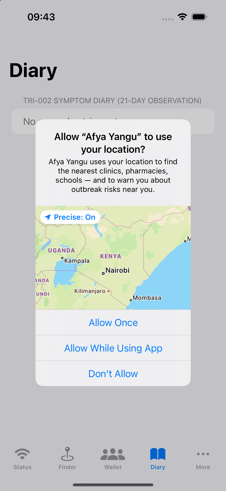 |
| **iOS CHW console** · **iOS evidence** | 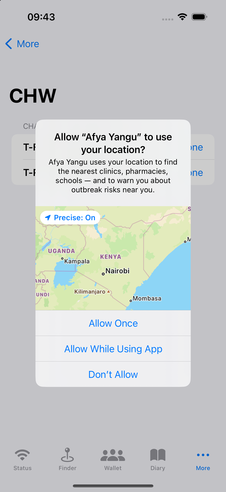 · 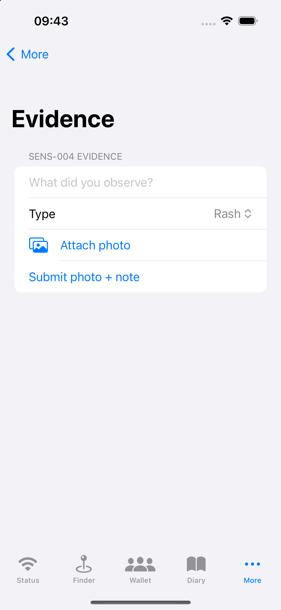 |
| **iOS maps (OSM + turn-by-turn)** |  |

To reproduce: `examples/serve_demo.py` on `:8123` + `adb reverse tcp:8000 tcp:8123` (Android installs from `android/app/build/outputs/apk/debug/`) or `xcrun simctl install … AfyaYangu.app` (`simctl spawn booted defaults write ke.go.health.AfyaYangu base_url http://localhost:8123`).

## 11 · Honest ledger of what is not here

Vendor/production credentials (telco gateways, WhatsApp Business, PPB endpoints), MoH-sourced content corpora, dermatology models (deliberate), and Postgres at production scale — every one has a coded seam; none is faked.